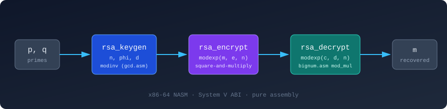
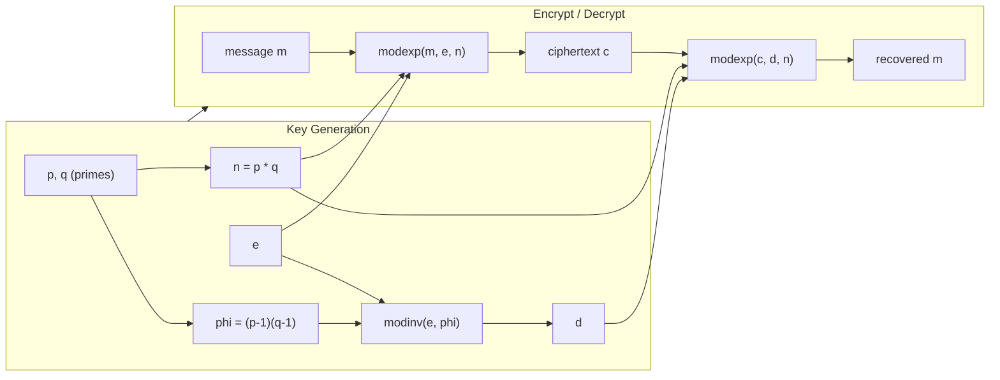
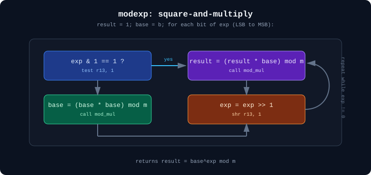

# RSA in x86-64 Assembly

[](#license)
[](#build)
[](#build)

A pure x86-64 **NASM** implementation of RSA — key generation, encryption, and decryption — built entirely from scratch in assembly. It implements the core number-theoretic primitives (modular multiplication, fast modular exponentiation via square-and-multiply, and the extended Euclidean algorithm) as hand-written routines, wired together with a small C-callable ABI and a `main.asm` driver.

> **Educational project.** It uses small 64-bit integers for clarity and is **not** cryptographically secure. Do not use it to protect real data.



## Why this exists

Most people learn RSA from pseudocode or a high-level language where `pow(base, exp, mod)` is one call. This project strips that abstraction away: every modular multiply, every squaring step, and every Euclidean-algorithm iteration is visible as raw `mov`/`mul`/`shr` instructions. It's meant as a learning tool for:

- Understanding how RSA's math maps onto real machine instructions
- Practicing x86-64 calling conventions (System V ABI) across multiple `.asm` translation units
- Seeing why 64-bit "textbook RSA" is easy to break, and why real implementations use bignum libraries

## How it works



`modexp` itself is square-and-multiply, calling `mod_mul` (from `bignum.asm`) on each bit of the exponent:



## Files

| File | Purpose |
|---|---|
| [`bignum.asm`](bignum.asm) | Modular multiplication (`mod_mul`) |
| [`modexp.asm`](modexp.asm) | Fast modular exponentiation via square-and-multiply |
| [`gcd.asm`](gcd.asm) | Extended GCD and modular inverse (`modinv`) |
| [`rsa_keygen.asm`](rsa_keygen.asm) | Key generation — computes `n`, `phi`, and `d` |
| [`rsa_encrypt.asm`](rsa_encrypt.asm) | Encryption wrapper around `modexp` |
| [`rsa_decrypt.asm`](rsa_decrypt.asm) | Decryption wrapper around `modexp` |
| [`main.asm`](main.asm) | Orchestrates the full flow and prints results |
| [`Makefile`](Makefile) | Build script (NASM + GCC linker) |
| [`test_vectors.txt`](test_vectors.txt) | Known small-prime test values |

## Build

Requires `nasm` and `gcc` on a 64-bit Linux (or WSL) system.

```bash
make
```

## Run

```bash
./rsa
```

### Expected output

```
n = 3233
d = 2753
Original message: 65
Encrypting with e=17, n=3233
Ciphertext: 2790
Plaintext: 65
```

You can change the primes, exponent, and message by editing the `p`, `q`, `e`, and `message` values in [`main.asm`](main.asm), then rebuilding.

## Notes & limitations

- Values are 64-bit integers — real RSA needs keys thousands of bits wide, which requires arbitrary-precision (bignum) arithmetic. `bignum.asm` here is a single modular-multiply routine, not a full bignum library.
- No padding scheme (e.g. OAEP) is implemented — this is "textbook RSA," which is deterministic and malleable.
- No primality testing or secure random prime generation; `p` and `q` are hardcoded.
- Given all of the above, treat this strictly as a reference for the *algorithm*, not a usable crypto library.

## Ideas for extending this project

- Replace fixed 64-bit registers with a bignum representation (arrays of limbs) to support real key sizes
- Add Miller-Rabin primality testing in assembly for prime generation
- Add OAEP padding
- Add a test harness that checks encrypt/decrypt round-trips against [`test_vectors.txt`](test_vectors.txt)

## License

MIT
