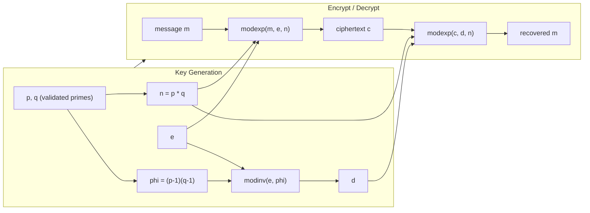

# RSA in x86-64 Assembly

[](https://github.com/imjbassi/rsa-asm64/actions/workflows/ci.yml)
[](LICENSE)
[](#build)
[](#build)

A pure x86-64 **NASM** implementation of RSA — key generation, encryption, and decryption — built entirely from scratch in assembly. It implements the core number-theoretic primitives (modular multiplication, fast modular exponentiation via square-and-multiply, the extended Euclidean algorithm, and a deterministic Miller–Rabin primality test) as hand-written routines, wired together with a small C-callable ABI and a `main.asm` driver.

> **Educational project.** It uses small 64-bit integers for clarity and is **not** cryptographically secure. Do not use it to protect real data.


## Why this exists

Most people learn RSA from pseudocode or a high-level language where `pow(base, exp, mod)` is one call. This project strips that abstraction away: every modular multiply, every squaring step, and every Euclidean-algorithm iteration is visible as raw `mov`/`mul`/`shr` instructions. It's meant as a learning tool for:

- Understanding how RSA's math maps onto real machine instructions
- Practicing x86-64 calling conventions (System V ABI) across multiple `.asm` translation units
- Seeing why 64-bit "textbook RSA" is easy to break, and why real implementations use bignum libraries

## How it works



`modexp` itself is square-and-multiply, calling `mod_mul` (from `bignum.asm`) on each bit of the exponent:


Key generation validates its inputs before doing anything else: `p` and `q` are checked with a **deterministic Miller–Rabin test** (`primality.asm`) that uses the 12-witness set proven correct for every 64-bit integer, `p * q` is checked for 64-bit overflow, and `gcd(e, phi) = 1` is verified via the extended Euclidean algorithm. Bad inputs produce a clear error on stderr and a nonzero exit code instead of garbage output.

## Files

| File | Purpose |
|---|---|
| [`bignum.asm`](bignum.asm) | Modular multiplication (`mod_mul`) using the 128-bit `MUL`/`DIV` pair |
| [`modexp.asm`](modexp.asm) | Fast modular exponentiation via square-and-multiply |
| [`gcd.asm`](gcd.asm) | Extended GCD and modular inverse (`modinv`) |
| [`primality.asm`](primality.asm) | Deterministic Miller–Rabin primality test for 64-bit integers |
| [`rsa_keygen.asm`](rsa_keygen.asm) | Key generation — validates inputs, computes `n`, `phi`, and `d` |
| [`rsa_encrypt.asm`](rsa_encrypt.asm) | Encryption wrapper around `modexp` |
| [`rsa_decrypt.asm`](rsa_decrypt.asm) | Decryption wrapper around `modexp` |
| [`main.asm`](main.asm) | Parses CLI arguments, orchestrates the full flow, verifies the round trip |
| [`Makefile`](Makefile) | Build script (NASM + GCC linker) |
| [`test_vectors.txt`](test_vectors.txt) | Known-good vectors, independently verified with Python's `pow` |
| [`run_tests.sh`](run_tests.sh) | Test harness: round-trips every vector and checks error handling |

## Build

Requires `nasm` and `gcc` on a 64-bit Linux (or WSL) system.

```bash
make        # build ./rsa
make test   # build and run the test suite
```

## Run

With no arguments, the classic textbook example (`p=61, q=53, e=17, m=65`) is used:

```bash
./rsa
```

```
p = 61, q = 53
n   = 3233
phi = 3120
e   = 17
d   = 2753
message    = 65
ciphertext = 2790
recovered  = 65
round-trip OK
```

Or pass your own parameters as `./rsa <p> <q> <e> <message>`:

```bash
$ ./rsa 4294967291 4294967279 65537 123456789
p = 4294967291, q = 4294967279
n   = 18446743979220271189
phi = 18446743970630336620
e   = 65537
d   = 9331878932546167513
message    = 123456789
ciphertext = 17663059933123306112
recovered  = 123456789
round-trip OK
```

Invalid inputs are rejected with a specific message:

```bash
$ ./rsa 15 53 17 65
error: p (15) is not prime

$ ./rsa 61 53 16 65
error: e (16) is not coprime with phi (3120)

$ ./rsa 61 53 17 5000
error: message (5000) must be smaller than n (3233)
```

## Testing

`make test` runs [`run_tests.sh`](run_tests.sh), which:

- round-trips every vector in [`test_vectors.txt`](test_vectors.txt) (from the textbook example up to a modulus near 2⁶⁴) and checks the ciphertext against an independently computed expected value, and
- feeds the program invalid inputs (composite primes, `p == q`, non-coprime `e`, out-of-range message, overflowing `p*q`, wrong argument count) and checks each is rejected with the right error and exit code.

CI runs the full build and test suite on every push via [GitHub Actions](.github/workflows/ci.yml).

## Notes & limitations

- Values are 64-bit integers — real RSA needs keys thousands of bits wide, which requires arbitrary-precision (bignum) arithmetic. `bignum.asm` here is a single modular-multiply routine, not a full bignum library.
- No padding scheme (e.g. OAEP) is implemented — this is "textbook RSA," which is deterministic and malleable.
- `p` and `q` are validated for primality but not generated: there's no secure random prime generation.
- Given all of the above, treat this strictly as a reference for the *algorithm*, not a usable crypto library.

## Ideas for extending this project

- Replace fixed 64-bit registers with a bignum representation (arrays of limbs) to support real key sizes
- Generate random primes in assembly (e.g. `RDRAND` + the existing Miller–Rabin test)
- Add OAEP padding
- Use the Carmichael function λ(n) = lcm(p-1, q-1) instead of Euler's φ(n)

## License

[MIT](LICENSE)
